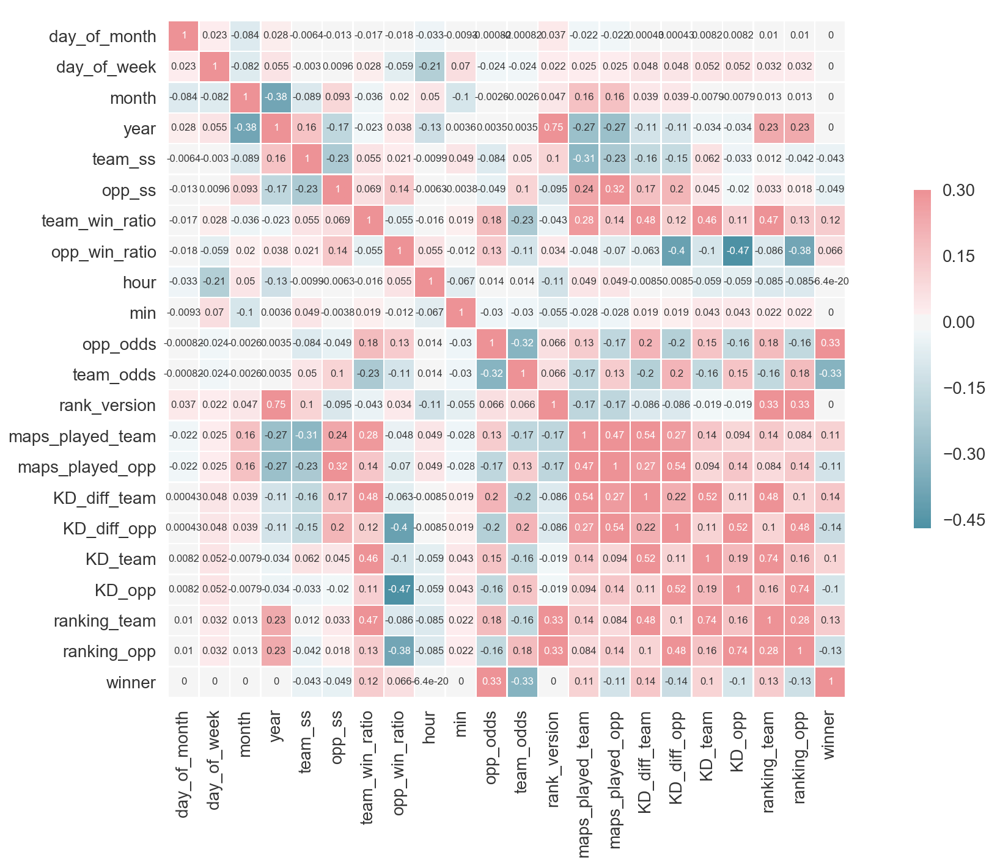

# eSports_Betting_Portfolio_Recommender

NOTE: THIS PROJECT IS PURELY A CONCEPT.

## Motivation:
Today eSports is one of the fastest growing industries. As of [early 2017 the industry was estimated as worth $689M with a compound annual growth rate of 40%](https://newzoo.com/insights/articles/esports-revenues-will-reach-696-million-in-2017/). And with this growth the emergency of eSports betting has been recently expanding eSports too. The goal of this project is to explore the possibility of building a prediction model that would have a better accuracy of predicting match outcomes than the odds of a betting market (beating the odds). With this in mind, I chose to look at predicting CS:GO matches. The bottom line is the eSports betting industry is a healthy growing segment.

## The Goal: Building a profitable model.
- In sports betting the ultimate goal is to beat the odds of a particular betting market. Not only to the odds represent the payout one would receive in the event of a successful match but they also represent the particular betting market's probability prediction of whether a particular team will win a match. With this concept in mind, the market's odds essentially represent the market's own predictive strength. You could look at a market's odds as the probability outcomes of their own classification models. If you look at the market's odds, translate them into probabilities and create classification predictions off these probabilities and compare with the known outcomes of those matches (target variable) you then get the baseline accuracy. If you build a model that has a higher accuracy than this baseline accuracy, then you now have a profitable model. This is the goal.

## Odds 101: Decimal Odds:

## Data collection: Web Scraping (2 web sources)
- History of CS:GO matches from 2012 to present(2018 Jan)
- Team statistics/ratings from 90days in the past of a match taking place.
- Market odds of a match durring this particular date.

## Feature Engineering: Calculating new predictive variables
- Team and Opponent Schedule Strength ratios (defined as team_ss and opp_ss in dataframe). Schedule strength ratio says for a given team in a match, what was the total ammount of wins all of their past opponents had / the total amount of games their past opponents played. This ratio was calculated in a past 60 day window.
- Team and Opponent win ratios. This metric captures a team's win streak in a given time window (60 days). Win ratio = (total past wins in the past 60 days) / (total past games in the past 60 days)

## Predictive strength of our features:

Main takeaways:
- The most highly correlated features (variables) to correctly predicting the target (winner) are not suprisingly, team_odds and opp_odds. Next biggest correlations are KD_diff_team, KD_diff_opp (difference in Kills/Deaths in a time window) and ranking_opp and ranking_team (This is a proprietary ranking metric that HLTV, a csgo stats website, built to rank teams for a given time frame, in this case the past 90 days). 

Model selection:
- Boosted Forest.

The User Experience (The data Product):
- 

Testing betting stategies:
- Once you have a model who's accuracy is hopefully above the market's baseline accuracy, then the next question is what is the most profitable betting strategy. Multiple betting strategies were explored:
1. Threshold strategy: In this stragegy the user will place a bet on a team when ever the model predicts the probability of that team winning is above a pre-defined threshold, say 60%.

2. Beating the odds #1: This strategy says, assuming you are above baseline accuracy, you should place a bet on the team where your model's probability of that team winning is higher than the market's probability. What this is essentially saying is that, since your model has a higher accuracy than the market's, the team where your model's probability is higher is the 'under-valued' team. It's undervalued because odds are calculated from these probabilites and represent the pay out. For example, if the market says 'SK Gaming' has a 35% chance of winning but your model says 'SK Gaming' has a 45% of winning, then the payout would be higher than the risk you are taking on placing money that bet. Odds ~= (Probability of winning / Probability of loosing), in this case 35% --> 35/65 or in Decimal form: 1/0.35 = 2.85 meaning you get $1.85 for a $1 put on the bet vs. our model's prediction of 45% --> 45/55 or in Decimal form: 1/0.45 = 2.22 meaning you'd get $1.22 for $1 put on the bet. We're saying the risk is worth $2.22, the market is saying the risk is higher, so the payout is more and we're getting a good deal on that particular bet.

3. Beating the odds #2: This strategy says, only place a bet on a team where our model says the team will win (it's probability of winning is above 50% from our model) and where the probability predicted from our model is greater than the market's probability.

4. Beating the odds #3:

5. Beating the odds #4:

